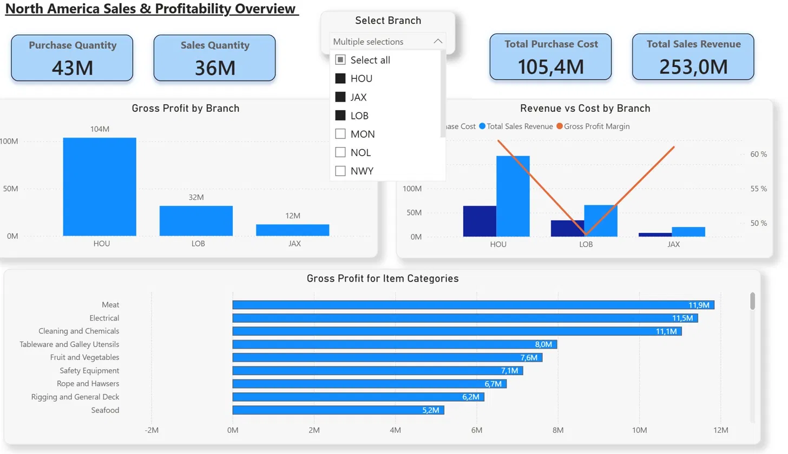
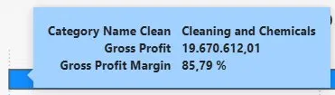
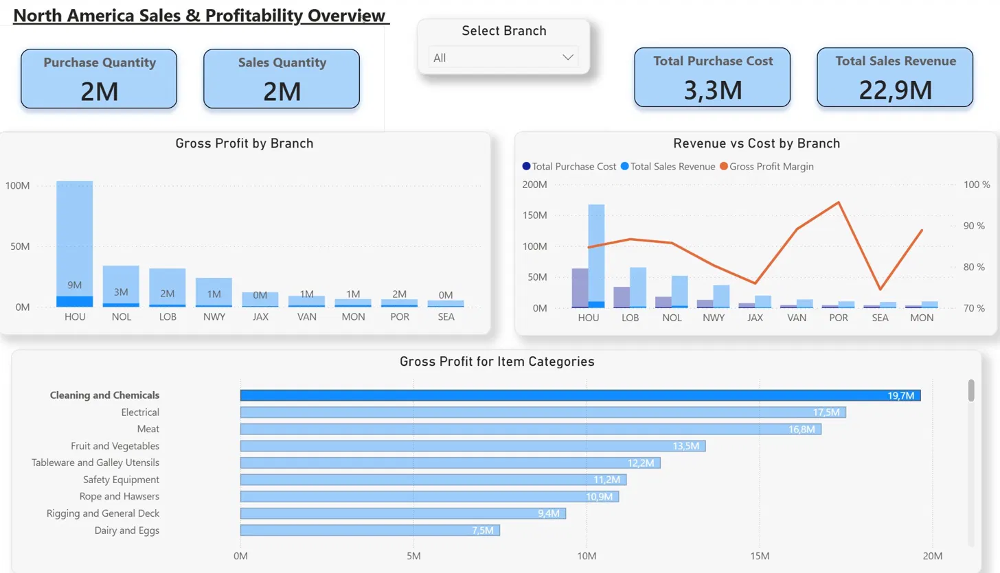
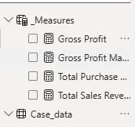
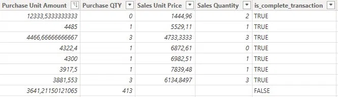

# North America Sales & Profitability Dashboard — Power BI

An end-to-end Power BI dashboard analysing branch-level sales, purchasing, and profitability across 9 branches in North America. Built as part of a practical business case to answer three core analytical questions.

---

## Dashboard Overview

![Dashboard Overview]


The dashboard provides a complete overview of North America sales and profitability across all 9 branches. Key metrics are displayed at the top, with detailed branch and category breakdowns below.

**Key metrics (all branches):**
- Purchase Quantity: 61M
- Sales Quantity: 50M
- Total Purchase Cost: 153.5M
- Total Sales Revenue: 386.6M

---

## Features

### Branch Filter


A dropdown slicer allows stakeholders to filter the entire dashboard by one or more branches simultaneously. All visuals update dynamically — including KPI cards, profit charts, and category breakdown.

### Tooltips


Hovering over any data point displays a detailed tooltip showing Gross Profit and Gross Profit Margin % for that specific category or branch.

### Cross-filtering


Clicking any visual filters all other visuals automatically. This example shows the dashboard filtered on the Cleaning and Chemicals category — highlighting its contribution across branches.

---

## Measures

Four measures were created in DAX:

```
Total Sales Revenue = 
SUMX('Case_data', 'Case_data'[Sales Unit Price] * 'Case_data'[Sales Quantity])

Total Purchase Cost = 
SUMX('Case_data', 'Case_data'[Purchase Unit Amount] * 'Case_data'[Purchase QTY])

Gross Profit = [Total Sales Revenue] - [Total Purchase Cost]

Gross Profit Margin = DIVIDE([Gross Profit], [Total Sales Revenue])
```

**Why SUMX:** SUMX calculates price × quantity on each individual row before summing — multiplying total price by total quantity would produce an incorrect result.



---

## Data Preparation



The following steps were taken in Power Query before building the dashboard:

- Verified column types — ensuring monetary and quantity columns were numerical
- Reviewed missing values using Power Query column quality view
- Created a boolean flag (`is_complete_transaction`) identifying rows where all four key fields are populated: Sales Unit Price, Sales Quantity, Purchase Unit Amount, and Purchase QTY

**Finding:** 89% of transactions were complete. The remaining 11% produced no change in branch ranking and minimal difference in overall results. All realized sales were therefore included in the final analysis.

**Profit is calculated on realized sales only** — rows where a sale has occurred. Rows with sales data but missing purchase data are included on the revenue side, as the absence of purchase data does not necessarily mean the item was not purchased.

---

## Key Findings

- **HOU** is the most profitable branch with 104M in gross profit — nearly 3x the second most profitable branch
- **NOL (34M) and LOB (32M)** are close competitors for second place
- **Cleaning and Chemicals, Electrical, and Meat** are the three most profitable product categories across all branches
- Gross profit margin is relatively consistent across branches (50-65%), indicating that HOU's dominance is driven by volume rather than superior pricing

---

## Data Limitations

Several limitations were identified that affect the interpretation of results:

- **No time dimension** — trends, growth, and seasonality cannot be analysed. All figures represent totals for an unknown period
- **No currency specified** — branches may operate in different markets; figures may not be directly comparable without currency conversion
- **Mixed units of measurement** — items are measured in PCS, KG, BOX and other units. Total quantities cannot be meaningfully aggregated across units
- **Unit conversion between purchase and sales** — items may be purchased in one unit (e.g. BOX) and sold in another (e.g. PCS). Without a conversion key, quantity comparisons are approximate
- **Negative values** — treated as returns and credit notes, consistent with how net revenue and costs are reported in financial statements
- **Zero values** — may represent free items, internal transfers, or data entry errors

---

## Tools

- Power BI Desktop
- Power Query
- DAX

---

## Skills Demonstrated

- Data preparation and quality assessment in Power Query
- DAX measure design (SUMX, DIVIDE)
- Dashboard layout and UX thinking
- Stakeholder-oriented design — dropdown slicer, tooltips, cross-filtering
- Critical analysis of data limitations
- Business-oriented communication of findings
